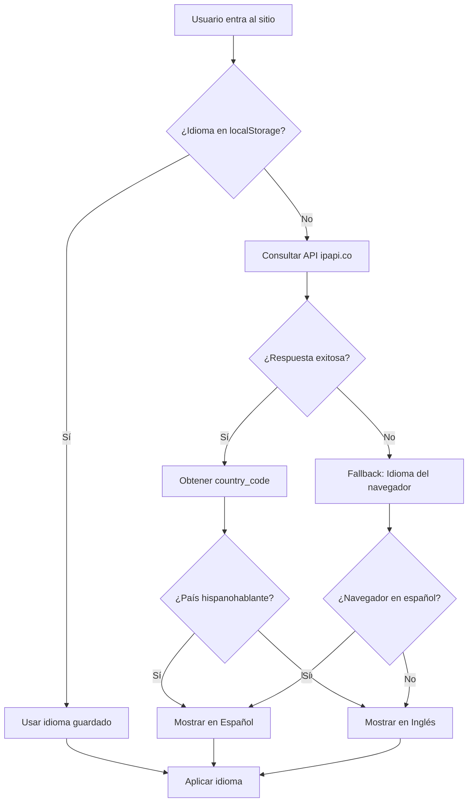

# Lógica de Detección de Idioma por IP

## Fecha: 3 de noviembre de 2025

## Resumen
Sistema de detección automática de idioma basado en geolocalización por IP que identifica si el usuario es de un país hispanohablante para mostrar el sitio en **español** o **inglés**.

---

## Regla Principal

### 🇪🇸 **Español (es-CL)**
Usuarios de **países hispanohablantes** ven el sitio en español automáticamente.

### 🇺🇸 **Inglés (en-US)**
Usuarios de **cualquier otro país** (no hispanohablante) ven el sitio en inglés.

---

## Países Hispanohablantes Detectados (23 países)

### 📍 Latinoamérica (18 países)
| Código | País |
|--------|------|
| AR | 🇦🇷 Argentina |
| BO | 🇧🇴 Bolivia |
| CL | 🇨🇱 Chile |
| CO | 🇨🇴 Colombia |
| CR | 🇨🇷 Costa Rica |
| CU | 🇨🇺 Cuba |
| DO | 🇩🇴 República Dominicana |
| EC | 🇪🇨 Ecuador |
| SV | 🇸🇻 El Salvador |
| GT | 🇬🇹 Guatemala |
| HN | 🇭🇳 Honduras |
| MX | 🇲🇽 México |
| NI | 🇳🇮 Nicaragua |
| PA | 🇵🇦 Panamá |
| PY | 🇵🇾 Paraguay |
| PE | 🇵🇪 Perú |
| UY | 🇺🇾 Uruguay |
| VE | 🇻🇪 Venezuela |

### 📍 Europa (1 país)
| Código | País |
|--------|------|
| ES | 🇪🇸 España |

### 📍 África (1 país)
| Código | País |
|--------|------|
| GQ | 🇬🇶 Guinea Ecuatorial |

### 📍 Territorios y Otros (2)
| Código | País/Territorio |
|--------|-----------------|
| PR | 🇵🇷 Puerto Rico |
| AD | 🇦🇩 Andorra (co-oficial) |

---

## Países No Hispanohablantes → Inglés

**TODOS los demás países** muestran el sitio en inglés automáticamente:

### Ejemplos:
- 🇺🇸 Estados Unidos → Inglés
- 🇬🇧 Reino Unido → Inglés
- 🇨🇦 Canadá → Inglés
- 🇦🇺 Australia → Inglés
- 🇩🇪 Alemania → Inglés
- 🇫🇷 Francia → Inglés
- 🇮🇹 Italia → Inglés
- 🇧🇷 Brasil (portugués) → Inglés
- 🇯🇵 Japón → Inglés
- 🇨🇳 China → Inglés
- 🇮🇳 India → Inglés
- ... y todos los demás

---

## Flujo de Detección



---

## Implementación Técnica

### API Utilizada
**ipapi.co** (gratuita, 30,000 requests/mes)
- Endpoint: `https://ipapi.co/json/`
- Respuesta: JSON con `country_code`

### Código Principal

```javascript
// Países hispanohablantes
const spanishSpeakingCountries = [
  // Latinoamérica
  'AR', 'BO', 'CL', 'CO', 'CR', 'CU', 'DO', 'EC', 'SV', 'GT', 
  'HN', 'MX', 'NI', 'PA', 'PY', 'PE', 'UY', 'VE',
  
  // Europa
  'ES',
  
  // África
  'GQ',
  
  // Territorios
  'PR', 'AD'
];

// Lógica
if (spanishSpeakingCountries.includes(countryCode)) {
  return 'es'; // Español
} else {
  return 'en'; // Inglés
}
```

---

## Fallback (si falla la API)

Si no se puede detectar la IP, el sistema usa el **idioma del navegador**:

```javascript
const browserLang = navigator.language; // ej: "es-CL", "en-US"
const langCode = browserLang.split('-')[0]; // "es" o "en"

if (langCode === 'es') {
  return 'es'; // Español
} else {
  return 'en'; // Inglés
}
```

### Ejemplos de fallback:
- Navegador en `es-CL` → Español
- Navegador en `es-ES` → Español
- Navegador en `es-MX` → Español
- Navegador en `en-US` → Inglés
- Navegador en `fr-FR` → Inglés (por defecto)
- Navegador en `pt-BR` → Inglés (por defecto)

---

## Persistencia (localStorage)

Una vez que el usuario:
1. Visita el sitio (detección automática), o
2. Cambia manualmente el idioma con el selector

El idioma se **guarda en localStorage**:
```javascript
localStorage.setItem('preferredLanguage', 'es' o 'en');
```

En visitas futuras, el sistema:
- ✅ **Prioriza** el idioma guardado
- ❌ **NO vuelve a consultar** la API (ahorra requests)

---

## Selector Manual de Idioma

El usuario siempre puede cambiar manualmente el idioma con el botón:

### Desktop
- Posición: Fixed, esquina superior derecha
- Diseño: 🇨🇱 ES / 🇺🇸 EN

### Mobile
- Posición: Dentro del menú hamburguesa
- Diseño: Botón full-width al final del menú

Al cambiar manualmente:
1. Se actualiza el idioma en pantalla
2. Se guarda en localStorage
3. Se actualiza el flag y texto del botón

---

## Ejemplos de Casos de Uso

### Caso 1: Usuario de Chile (primera visita)
1. IP detectada → `CL`
2. `CL` está en `spanishSpeakingCountries`
3. Sitio se muestra en **Español**
4. Idioma guardado: `'es'` en localStorage

### Caso 2: Usuario de Estados Unidos (primera visita)
1. IP detectada → `US`
2. `US` NO está en `spanishSpeakingCountries`
3. Sitio se muestra en **Inglés**
4. Idioma guardado: `'en'` en localStorage

### Caso 3: Usuario de España (primera visita)
1. IP detectada → `ES`
2. `ES` está en `spanishSpeakingCountries`
3. Sitio se muestra en **Español**
4. Idioma guardado: `'es'` en localStorage

### Caso 4: Usuario de Brasil (primera visita)
1. IP detectada → `BR`
2. `BR` NO está en `spanishSpeakingCountries`
3. Sitio se muestra en **Inglés**
4. Idioma guardado: `'en'` en localStorage

### Caso 5: Usuario con VPN o API falla
1. API no responde
2. Fallback: Detectar idioma del navegador
3. Si navegador en español → **Español**
4. Si navegador en otro idioma → **Inglés**

### Caso 6: Usuario que cambia manualmente
1. Usuario de EEUU (inglés automático)
2. Cambia a español con el selector
3. Idioma guardado: `'es'` en localStorage
4. Próxima visita → **Español** (sin consultar IP)

---

## Ventajas del Sistema

1. ✅ **Automático**: El usuario no necesita elegir, el sitio "adivina" correctamente
2. ✅ **Completo**: Cubre TODOS los países hispanohablantes del mundo
3. ✅ **Rápido**: Detección en ~200-500ms (API rápida)
4. ✅ **Persistente**: Guarda preferencia para futuras visitas
5. ✅ **Fallback inteligente**: Si falla la API, usa el navegador
6. ✅ **Manual override**: El usuario puede cambiar cuando quiera
7. ✅ **Eficiente**: Solo consulta la API una vez (luego usa localStorage)

---

## Logs de Consola

El sistema genera logs para debugging:

```javascript
[i18n] Inicializando sistema de internacionalización...
[i18n] No hay idioma guardado. Detectando por IP...
[i18n] Consultando API de geolocalización...
[i18n] Datos de geolocalización: {country: "CL", country_code: "CL", ...}
[i18n] País hispanohablante detectado: CL → Español
[i18n] Aplicando idioma: es
[i18n] Sistema inicializado en idioma: es
```

---

## Testing

### Para probar detección por IP:
1. Usar VPN para cambiar de país
2. Limpiar localStorage: `localStorage.removeItem('preferredLanguage')`
3. Recargar página
4. Verificar idioma detectado en consola

### Para probar fallback:
1. Bloquear dominio ipapi.co (Network tab de DevTools)
2. Cambiar idioma del navegador
3. Limpiar localStorage
4. Recargar página
5. Verificar que use idioma del navegador

---

## Limitaciones Conocidas

1. **API Rate Limit**: 30,000 requests/mes (suficiente para ~1,000 visitas/día)
2. **VPN/Proxy**: Si el usuario usa VPN, se detecta la IP del VPN
3. **Navegador privado**: No guarda preferencia entre sesiones (localStorage no persiste)
4. **IP corporativa**: Oficinas con IP centralizada pueden mostrar país incorrecto

---

## Alternativas de API

Si ipapi.co no funciona, alternativas:

1. **ipwhois.app**: 10,000 requests/mes gratuitos
2. **ip-api.com**: 45 requests/min gratuitos
3. **ipgeolocation.io**: 1,000 requests/día gratuitos
4. **ipify + ipapi**: Combinación de servicios

---

## Archivo Modificado

✅ **`js/i18n.js`**
- Líneas 64-94: Lista completa de países hispanohablantes (23 países)
- Líneas 98-103: Lógica de detección simplificada
- Líneas 105-120: Fallback mejorado con navegador

---

## Conclusión

El sistema ahora detecta **correctamente** si el usuario es de un país hispanohablante y muestra el sitio en el idioma apropiado:

- **Español**: Para los 23 países hispanohablantes
- **Inglés**: Para TODOS los demás países del mundo

El usuario siempre puede cambiar manualmente con el selector de idioma. 🌍
